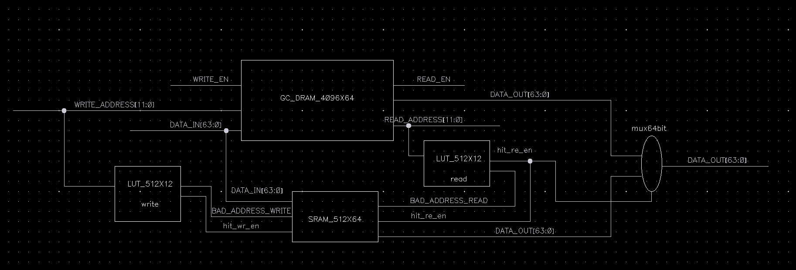
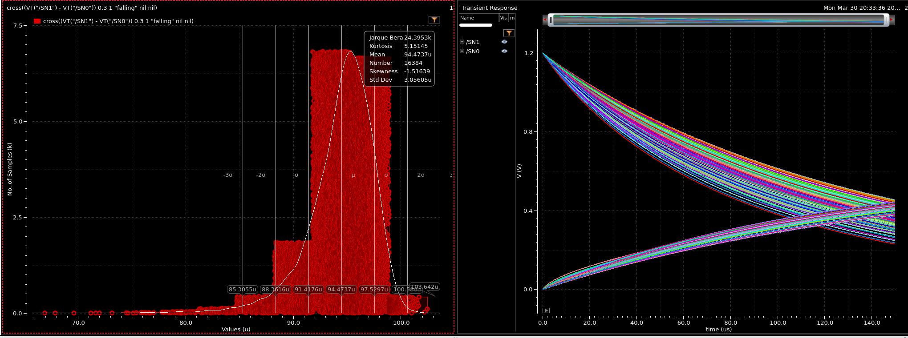
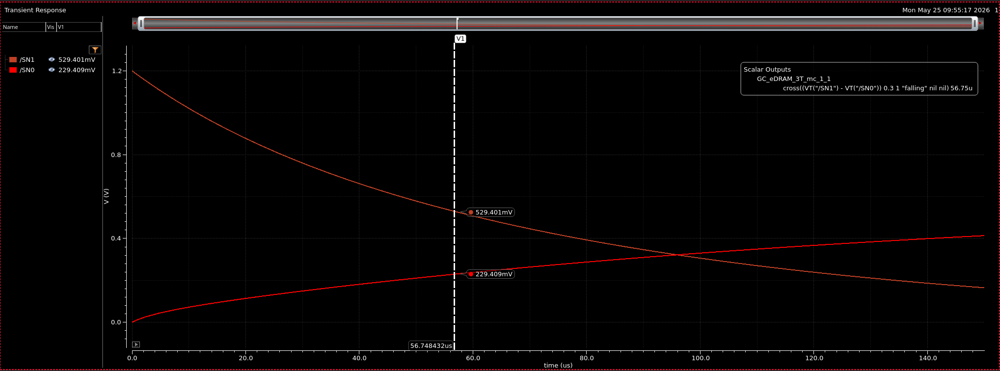
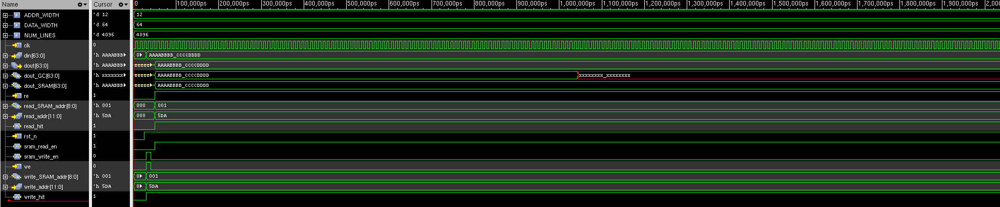

# B.Sc. Final Project: GC-eDRAM DRT Optimization

**Authors:** Yaniv Terner  
**Supervisor:** Roman Golman (Prof. Adam Teman's Research Group)

## 📌 Project Overview
This project focuses on optimizing the **Data Retention Time (DRT)** for Gain-Cell embedded DRAM (GC-eDRAM) to improve overall memory energy efficiency and maximize memory availability by reducing refresh downtime. 

## 💡 System Architecture

## 📊 Statistical Distribution & Decay

## 🧪 Simulation Results

---
*Developed as part of the B.Sc. Electrical Engineering curriculum at Bar-Ilan University, specializing in Nanoelectronics and Optics.*
